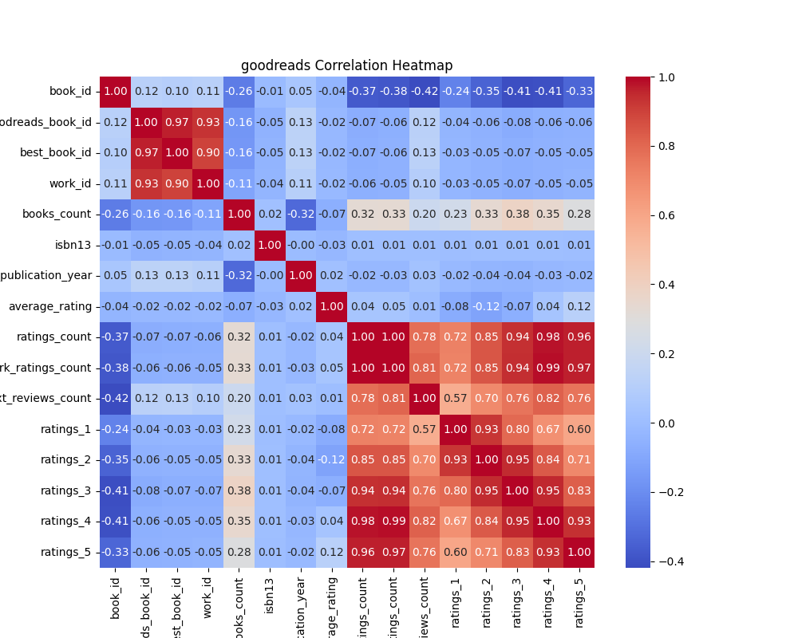
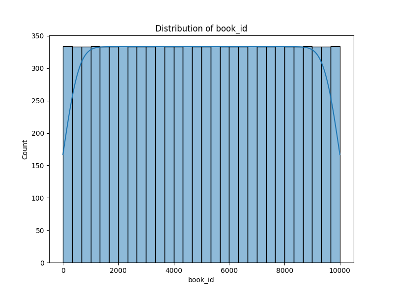
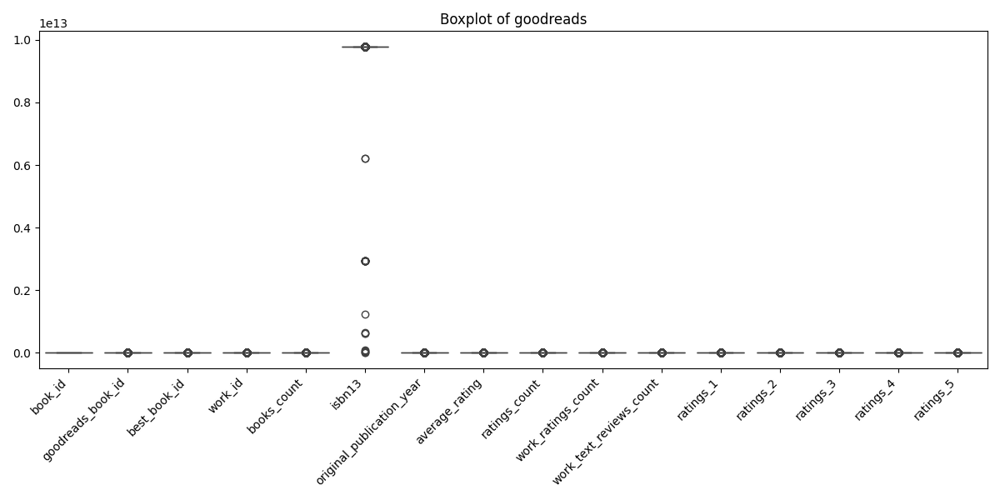
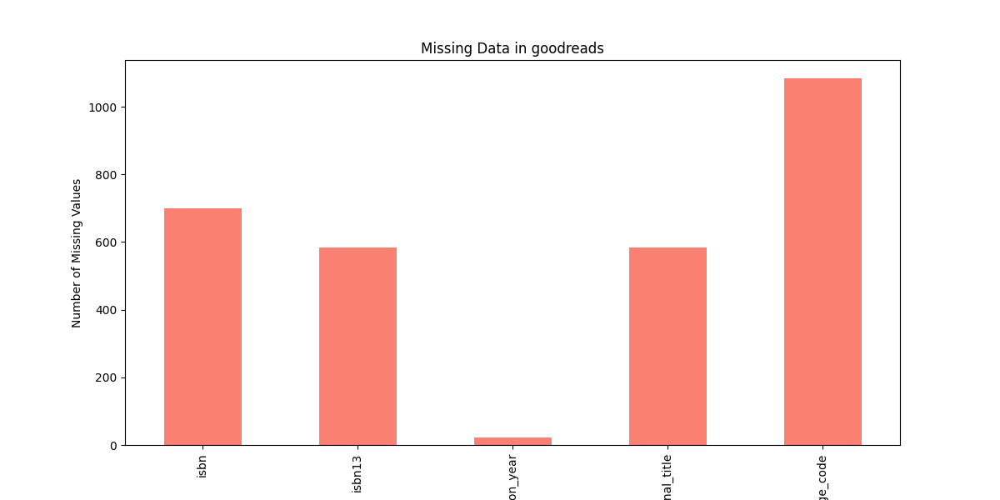

# Analysis Report

## Narrative on Insights and Implications from the Literature Dataset

In a world rife with options for literature, the analysis of a comprehensive dataset encompassing 10,000 books unveils a treasure trove of insights into reader preferences, author popularity, and trends in the publishing landscape. This examination not only sheds light on individual books but also offers a lens into the broader evolution of literature over recent years.

### High Average Ratings: The New Literary Renaissance

A prominent observation from the dataset is the generally high average ratings across the board, with standout titles like "Harry Potter and the Philosopher's Stone" attaining impressive averages of 4.44. This trend of elevated ratings suggests a positive reception of contemporary literature, indicating that modern readers may be increasingly discerning in their tastes yet favorable towards well-crafted narratives. Such preferences could reflect a renaissance in publishing, where quality storytelling is celebrated and amplified by social media and online platforms such as Goodreads.

### Author Popularity: The Phenomenon of Repeat Recognition

The dataset reveals that certain authors, including the likes of Suzanne Collins and J.K. Rowling, have multiple entries owing to various editions of their beloved works. This not only highlights their sustained popularity but also raises questions about the factors driving consistent reader engagement with specific authors. Are their stories continually captivating, or is it the nostalgia associated with their earlier works that keeps readers coming back? This phenomenon presents a unique opportunity for further exploration of author branding and the life cycle of book sales.

### Trends in Publication Years: A Shift to the Contemporary

Another significant finding relates to the concentration of highly rated books published in the past two decades. This trend aligns with evolving reader expectations, where contemporary themes, diversity in storytelling, and innovative narratives resonate deeply with audiences today. The rise of digital reading platforms and the democratization of publishing further catalyze these trends, enabling a broader array of voices to contribute to the literary landscape. Understanding this shift could provide publishers with insights into market demands and guide decisions on future book releases.

### Language Diversity: The Multilingual Frontier

The dataset’s revelation of missing values in the `language_code` column raises intriguing possibilities about the multilingual character of modern literature. The presence of bilingual or multilingual editions may suggest a growing demand for literature that transcends linguistic boundaries, catering to diverse audiences. This observation paves the way for deeper analysis into how language influences readership and the potential markets for translated works.

### Unraveling Missing Data: Challenges and Opportunities

Significant missing values in crucial fields like `isbn` and `original_title` serve as both a challenge and an avenue for improvement in analysis. Such gaps could skew interpretations of trends and demographics, highlighting the necessity of a comprehensive strategy for addressing these missing entries. By employing imputation techniques or conducting targeted outreach to gather missing information, analysts could enhance the robustness of their findings significantly.

### Recommendations for Future Inquiry

Further exploration of this dataset beckons a multi-faceted research approach. Correlation analyses could unveil relationships between average ratings and factors such as publication year or author popularity, offering a deeper understanding of what truly captivates readers. Investigating trends over time may lead to uncovering shifts in literary tastes, while genre-specific analysis could illuminate preferences tied to specific movements in literature.

### Conclusion: A Gateway to Literary Insights

This dataset represents more than just numbers and entries; it serves as a gateway to understanding the dynamic and evolving world of literature. Each book captures the imagination of readers, while the aggregated data paints a broader picture of cultural and societal trends. As we delve deeper into these insights, we unlock the potential to shape future storytelling, imbuing literature with both nostalgia and innovation—and ultimately enriching the reading experience for generations to come.

## Visualizations

