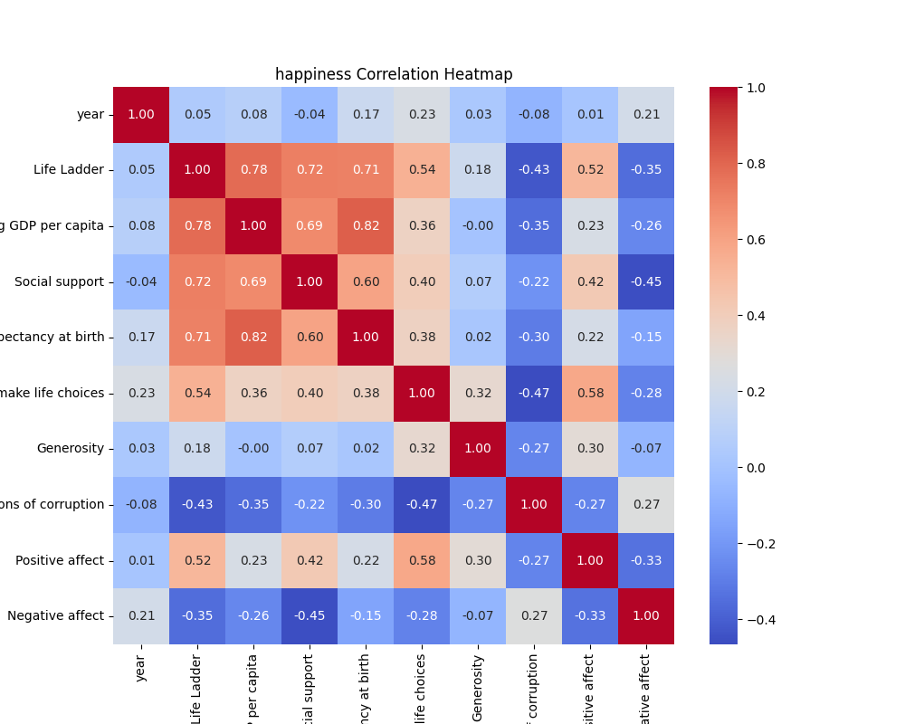
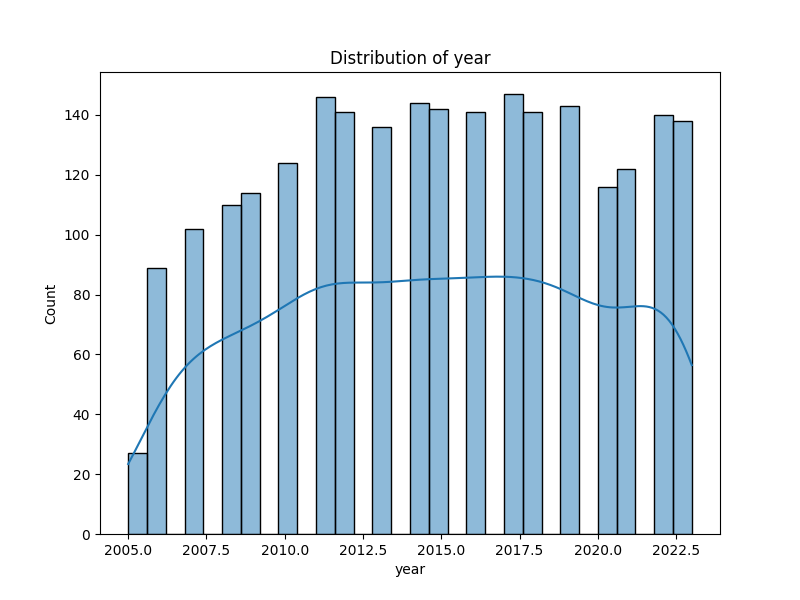
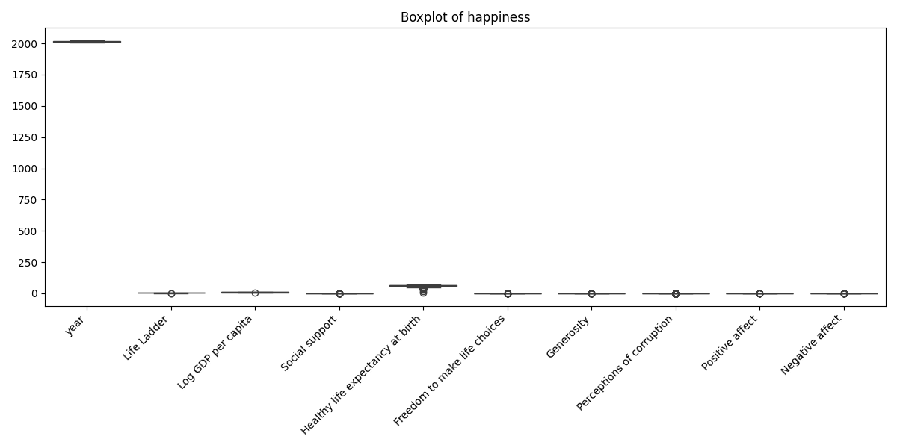
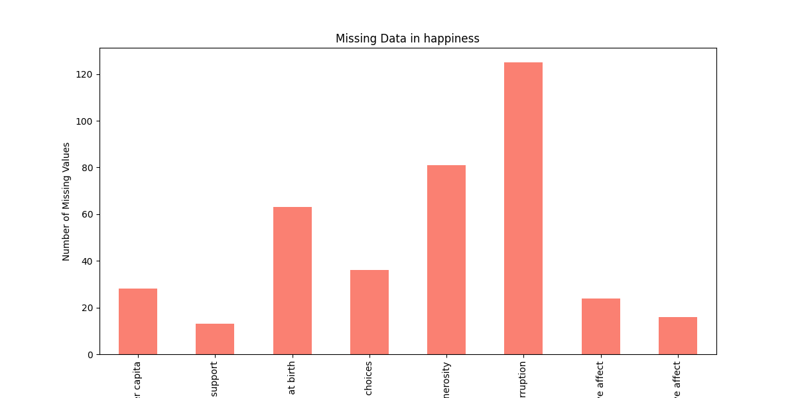

# Analysis Report

### Narrative on Insights and Implications from the Life Satisfaction Dataset

In our exploration of global subjective well-being, we turn our attention to a comprehensive dataset comprising 2,363 entries from 165 countries. Each entry provides nuanced insights into the factors affecting a country’s Life Ladder score—an indicator of perceived life satisfaction. By dissecting this dataset, we can begin to weave a rich narrative about the interplay of economic performance, social structures, and personal freedoms in shaping human experiences across diverse global contexts.

#### The Multidimensional Fabric of Well-Being

At the heart of this analysis lies the Life Ladder metric, acting as a barometer of happiness and life satisfaction. Notably, countries with robust economies often exhibit higher satisfaction levels, underlining a crucial correlation between economic stability (measured by Log GDP per capita) and well-being. For instance, our data shows fluctuations in Life Ladder scores in certain countries like Afghanistan, where an increase from 3.724 to 4.758 suggests a remarkable shift in perceived well-being that may correlate with socio-economic enhancements or external aid influences.

This positive trajectory, however, is not ubiquitous. Some nations continue to grapple with stagnant or declining life satisfaction, hinting at the complex realities that extend beyond mere economic indicators. By focusing on countries with significant growth in the Life Ladder, we not only celebrate improvements but also investigate underlying causes, such as increases in social support or enhancements in perceived freedoms.

#### Unpacking the Correlation Matrix

With a focus on relationships within the dataset, a correlation analysis may uncover which dimensions most profoundly impact the Life Ladder. Factors like social support, healthy life expectancy at birth, and freedom to make life choices will likely emerge as key influences. For instance, countries that score higher in social support may demonstrate a marked improvement in Life Ladder metrics, showcasing the value of community and interpersonal connectivity in enhancing individual well-being.

Conversely, countries plagued by high perceptions of corruption might reveal a stark contrast in Life Ladder scores. The narrative surrounding institutional integrity is pivotal—where corruption thrives, so too may disillusionment with societal structures, leading to decreased life satisfaction. This correlation invites a broader conversation about governance and how it impacts the lived experiences of individuals in society.

#### Charting Missing Values as an Indicator of Data Integrity

The dataset’s gaps present a significant avenue for consideration. With various measures exhibiting notable missing values, from healthy life expectancy to perceptions of corruption, the narrative that emerges could suggest systemic shortcomings in data collection methods. Addressing these gaps through thoughtful imputation or filtering may refine our analysis and strengthen our conclusions. 

#### Country-Specific Journeys

Delving into country-specific trends unearths rich, localized stories that collectively shape our understanding of global well-being. For instance, examining how countries have navigated their socio-economic challenges or external pressures over time could reveal emerging themes. Are nations that prioritize social welfare enhancing their citizens' quality of life? Are autocratic systems fostering discontent despite economic growth? These questions prompt deeper exploration and could catalyze policy discussions aimed at promoting well-being.

#### Recommendations for Visualization and Advanced Analysis

Visual representation of our findings will enhance storytelling. Plotting changes in the Life Ladder against economic indicators or social measures creates vivid illustrations of trends, allowing stakeholders to grasp complex relationships at a glance. Similarly, employing multivariate regression analysis will enable us to isolate variable impacts on Life Ladder scores, ushering in predictive insights that can guide future initiatives aimed at improving well-being.

### Conclusion

The dataset represents a fertile ground for discovering how various factors coalesce to influence life satisfaction. The potential implications of this analysis extend beyond academic curiosity—they touch on critical policymaking spheres, urging governments to consider holistic approaches. By prioritizing social support, improving governance, and recognizing the importance of personal freedoms, countries can chart a course toward enhanced well-being for their citizens, turning the aspirations reflected in the Life Ladder into a reality. 

This narrative underscores the power of data-driven storytelling—transforming raw numbers into meaningful insights that can inspire action and drive change across the globe. As we move forward, the commitment to understanding and improving well-being must remain at the forefront of our analyses and discussions, weaving a tapestry of hope and progress across nations.

## Visualizations

