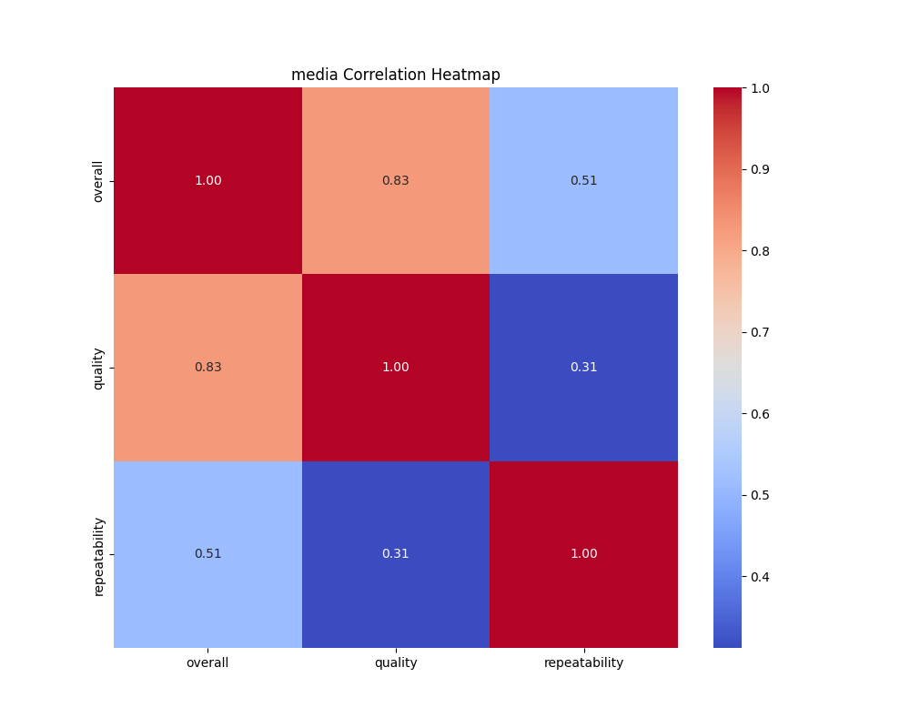
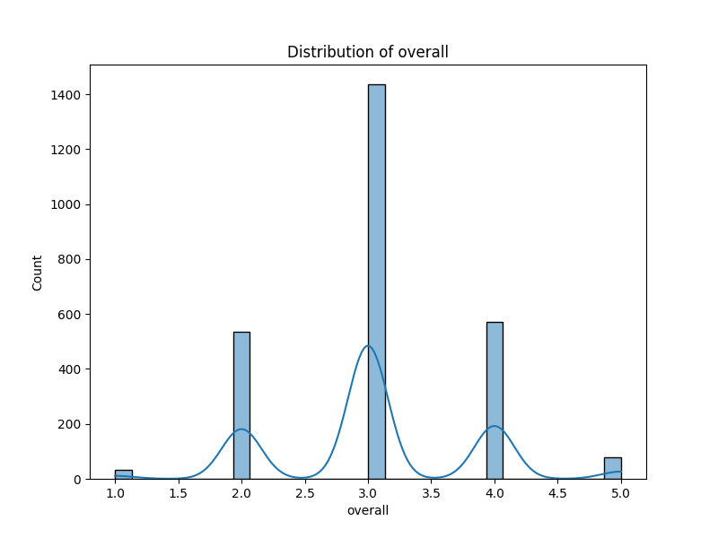
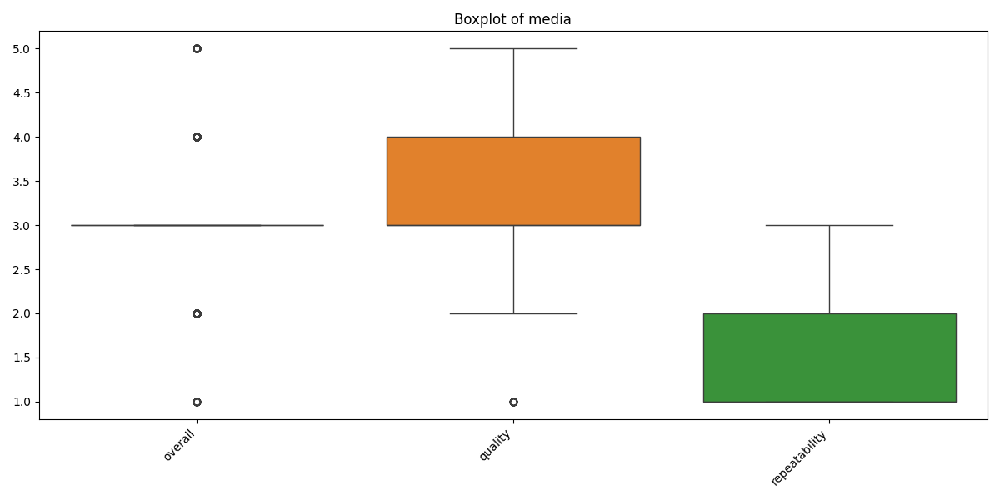
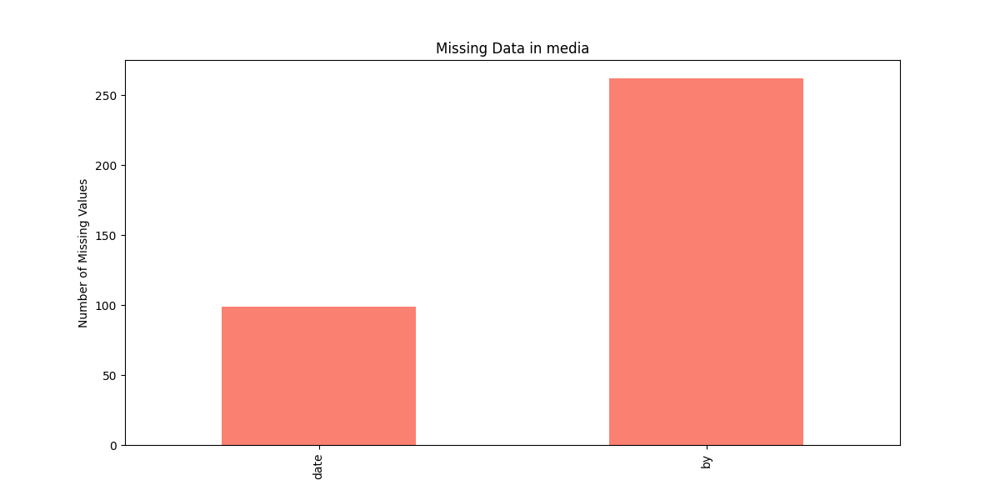

# Analysis Report

### Narrative: Insights from the Movie Dataset

In the vibrant landscape of cinema, where storytelling transcends cultural boundaries, our analysis of a comprehensive movie dataset sheds light on viewer expectations, preferences, and the intrinsic qualities of films, especially those in the Tamil and Telugu languages. With a total of 2553 movie entries, this dataset represents a significant sampling of cinematic contributions, paving the way for a deeper exploration of audience reception and film quality.

**Viewer Reception: A Mixed Bag of Satisfaction**

The average overall rating of 3.05, paired with a quality rating of 3.21, indicates a nuanced landscape of viewer satisfaction. These moderate scores suggest that while many films resonate positively with audiences, there is a substantial opportunity for improvement. The standard deviations of 0.76 and 0.80 highlight the diversity of opinions among viewers, indicating a spectrum where some films are cherished while others are perhaps dismissed or criticized.

This mixed reception raises essential questions: What elements contribute to these ratings? Do certain genres or themes tend to garner higher scores? Our analysis invites filmmakers and content creators to delve deeper into the factors influencing viewer ratings, potentially cultivating improvements in narrative structure, character development, and production quality to better meet audience expectations.

**Language and Cultural Representation**

Language serves as a powerful lens through which we understand cultural contexts in storytelling. The dataset reveals Tamil as the most frequent language (1306 entries), marking its prominence in this collection. This dominance may not only reflect the popularity of Tamil cinema but also highlights the need to explore the narratives and themes prevalent in these films. By contrasting Tamil movies with others in the dataset, we can uncover nuanced differences in storylines, character portrayals, or even the cultural contexts that resonate strongly with their respective audiences.

As we consider the linguistic diversity of the dataset—comprising 11 different languages—it becomes crucial to recognize the cinematic narratives unique to each language. Cross-language comparisons can reveal underlying themes and differences in viewer preferences, fostering a richer appreciation for the global cinematic landscape.

**The Actor's Influence**

The presence of numerous unique individuals (1528) associated with the movies allows for an exciting exploration of actor influence on ratings. Are there particular actors whose films consistently receive higher ratings? By identifying these correlations, we can glean insights not only about individual performers but also about the types of roles and genres they gravitate toward. This analysis could serve as a valuable tool for casting directors and producers, guiding them to make informed decisions that align with audience preferences.

**Addressing Missing Values for Enhanced Completeness**

While the dataset provides a wealth of information, the missing values present a challenge that calls for strategic intervention. With 99 missing values in the `date` column and 262 in the `by` column, there is an opportunity to refine the dataset's completeness. Employing data cleaning techniques, such as imputation based on average ratings or category modes, will enhance the dataset's reliability and provide a richer context for our analyses. Addressing these gaps will not only improve the dataset's integrity but will also empower us to conduct more refined analyses, paving the way for richer insights.

**Exploring Trends and Repeatability**

To understand the evolving tastes of audiences, a trend analysis across the `date` column—once missing values are managed—will highlight shifts in viewer preferences over time. Are quality and overall ratings improving? Are there specific time periods where film quality peaked? These insights can inform future filmmakers about the changing dynamics of audience preferences.

Moreover, analyzing the `repeatability` factor offers a unique perspective on rewatch value. If certain films are deemed more watchable, what qualities do they possess? How do these films correlate with higher ratings? This line of inquiry has the potential to enrich our understanding of cinematic excellence.

### Conclusion: A Call for Thoughtful Exploration

The dataset serves as a rich tapestry of cinema, interwoven with cultural significance, viewer sentiment, and artistic expressions. By uncovering patterns, making cross-language comparisons, and understanding the impact of individual actors, stakeholders in the film industry can draw actionable insights for crafting narratives that captivate audiences. 

As we continue to explore this dataset, let us embrace the stories it tells, fostering a deeper appreciation for the cinematic arts and their influence on society. The journey through data not only enhances our understanding of films but also empowers us to shape the narratives of tomorrow’s cinema.

## Visualizations

